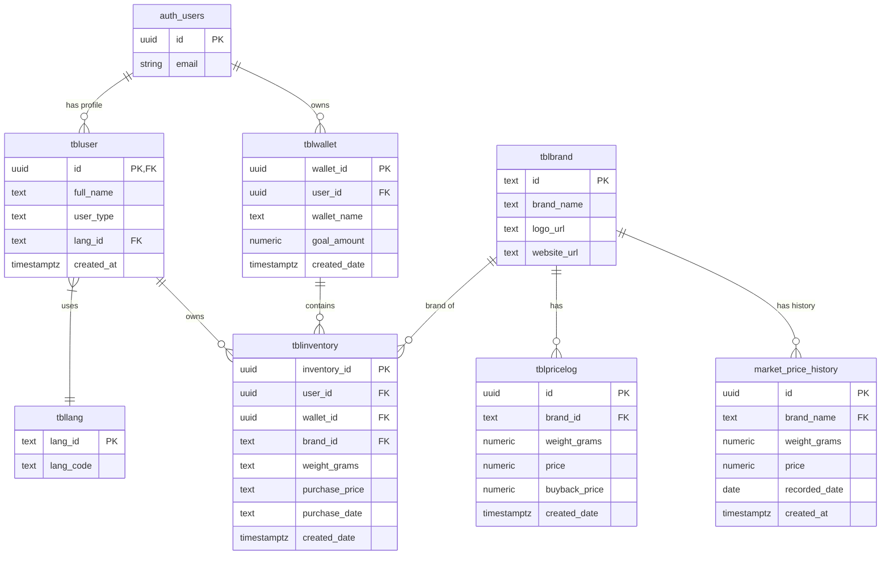

# Database Architecture & ERD - NTGold App

## 1. Overview
Database NTGold di-hosting menggunakan **Supabase (PostgreSQL)**. Desain ini mencakup modul Autentikasi (`auth.users`) yang terintegrasi secara seamless dengan tabel *public* untuk kebutuhan manajemen pengguna, portofolio (inventory), wallet (goals), dan pencatatan riwayat harga pasar.

## 2. Entity Relationship Diagram (ERD)



## 3. Database Functions (Triggers)

### `handle_new_user`
Trigger yang berjalan otomatis setiap kali ada pendaftaran user baru pada modul `auth.users` Supabase. Fungsi ini menyalin data ID dan Meta-data (Full Name) ke dalam tabel `tbluser` di skema `public` dengan *user_type* bawaan `free` dan *lang_id* `1` (default language).

**PL/pgSQL Definition:**
```plpgsql
BEGIN
  INSERT INTO public.tbluser (id, full_name, user_type, lang_id)
  VALUES (new.id, new.raw_user_meta_data->>'full_name', 'free', '1');
  RETURN new;
END;
```

## 4. Database Indexes
Untuk mempercepat proses *query*, Supabase menggunakan index berikut (di luar *Primary Key* standar):
- `market_price_history_brand_name_weight_grams_recorded_date_key`: Unique Key untuk memastikan tidak ada duplikasi data harga harian per *brand* dan ukuran gram pada tanggal yang sama.
- `tblbrand_brand_name_key`: Unique Key untuk memastikan nama brand tidak ada yang ganda.
- `tbllang_lang_code_key`: Unique Key untuk memastikan kode bahasa unik.

## 5. Security Policies (Row Level Security - RLS)

Keamanan data dipastikan menggunakan RLS pada tabel `public`:

1. **`market_price_history` & `tblbrand` & `tbllang` & `tblpricelog`**: 
   - `Public read` (SELECT): Data ini bersifat publik, siapapun (walau belum login) bisa membaca data harga dan brand.
2. **`tbluser`**:
   - `User can read own profile` (SELECT): Pengguna hanya bisa membaca data profilnya sendiri (pencocokan `auth.uid() = id`).
   - `User can update own profile` (UPDATE): Pengguna hanya bisa mengubah profilnya sendiri.
3. **`tblinventory`**:
   - `User read/insert/update/delete own inventory`: Pengguna memiliki otoritas penuh (CRUD) terhadap baris data inventori (portofolio emas) yang dimiliki oleh `user_id` yang cocok dengan `auth.uid()`. Pengguna lain tidak bisa melihat aset yang bukan miliknya.
