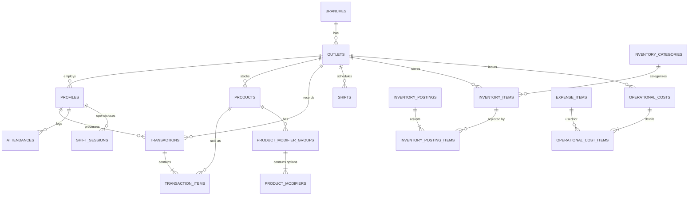

# Database Architecture & ERD - NTPOS

Sistem database menggunakan **Supabase (PostgreSQL)** dengan fokus tinggi pada keamanan tingkat baris (Row Level Security) dan otomatisasi bisnis melalui *Triggers* dan *Functions*. Dokumen ini memuat keseluruhan skema, kebijakan, dan fungsi bawaan yang menjadi tulang punggung NTPOS.

## 1. Entity Relationship Diagram (ERD)



---

## 2. Table Schemas

### Table `outlets`
| Name | Type | Constraints |
|------|------|-------------|
| `id` | `uuid` | Primary |
| `name` | `text` |  |
| `address` | `text` |  Nullable |
| `created_at` | `timestamptz` |  |
| `branch_id` | `uuid` |  Nullable |
| `phone` | `text` |  Nullable |
| `code` | `varchar` |  Nullable |
| `tax_rate_percent` | `numeric` |  Nullable |
| `mdr_fees` | `jsonb` |  Nullable |

### Table `profiles`
| Name | Type | Constraints |
|------|------|-------------|
| `id` | `uuid` | Primary |
| `email` | `text` |  Unique |
| `role` | `text` |  |
| `outlet_id` | `uuid` |  Nullable |
| `created_at` | `timestamptz` |  |
| `branch_id` | `uuid` |  Nullable |
| `name` | `text` |  Nullable |
| `status` | `text` |  Nullable |
| `shift_id` | `uuid` |  Nullable |

### Table `products`
| Name | Type | Constraints |
|------|------|-------------|
| `id` | `uuid` | Primary |
| `outlet_id` | `uuid` |  Nullable |
| `name` | `text` |  |
| `price` | `numeric` |  |
| `stock` | `int4` |  Nullable |
| `image_url` | `text` |  Nullable |
| `created_at` | `timestamptz` |  |
| `price_gofood` | `numeric` |  Nullable |
| `price_shopeefood` | `numeric` |  Nullable |
| `price_grabfood` | `numeric` |  Nullable |

### Table `transactions`
| Name | Type | Constraints |
|------|------|-------------|
| `id` | `uuid` | Primary |
| `outlet_id` | `uuid` |  Nullable |
| `cashier_id` | `uuid` |  Nullable |
| `total_amount` | `numeric` |  |
| `payment_method` | `text` |  Nullable |
| `created_at` | `timestamptz` |  |
| `customer_name` | `text` |  Nullable |
| `subtotal_amount` | `numeric` |  Nullable |
| `discount_amount` | `numeric` |  Nullable |
| `tax_amount` | `numeric` |  Nullable |
| `receipt_no` | `text` |  Nullable |
| `cash_received` | `numeric` |  Nullable |
| `change_amount` | `numeric` |  Nullable |
| `shift_session_id` | `uuid` |  Nullable |
| `status` | `text` |  Nullable |
| `voided_at` | `timestamptz` |  Nullable |
| `void_reason` | `text` |  Nullable |
| `voided_by` | `uuid` |  Nullable |
| `notes` | `text` |  Nullable |

### Table `transaction_items`
| Name | Type | Constraints |
|------|------|-------------|
| `id` | `uuid` | Primary |
| `transaction_id` | `uuid` |  Nullable |
| `product_id` | `uuid` |  Nullable |
| `quantity` | `int4` |  |
| `price` | `numeric` |  |
| `created_at` | `timestamptz` |  |
| `modifiers` | `jsonb` |  Nullable |

### Table `branches`
| Name | Type | Constraints |
|------|------|-------------|
| `id` | `uuid` | Primary |
| `name` | `text` |  |
| `created_at` | `timestamptz` |  |

### Table `attendance` (and `attendances`)
| Name | Type | Constraints |
|------|------|-------------|
| `id` | `uuid` | Primary |
| `profile_id` / `user_id` | `uuid` |  Nullable |
| `outlet_id` | `uuid` |  Nullable |
| `date` / `clock_in` | `date` / `timestamptz` |  |
| `clock_out` | `timestamptz` |  Nullable |
| `notes` | `text` |  Nullable |
| `created_at` | `timestamptz` |  |

### Table `cash_drawer_sessions`
| Name | Type | Constraints |
|------|------|-------------|
| `id` | `uuid` | Primary |
| `outlet_id` | `uuid` |  Nullable |
| `profile_id` | `uuid` |  Nullable |
| `shift_id` | `uuid` |  Nullable |
| `starting_cash` | `numeric` |  |
| `start_time` | `timestamptz` |  |
| `end_time` | `timestamptz` |  Nullable |
| `status` | `text` |  |
| `created_at` | `timestamptz` |  |

### Table `inventory_items` & `inventory_categories`
| Name | Type | Constraints |
|------|------|-------------|
| `id` | `uuid` | Primary |
| `outlet_id` | `uuid` |  Nullable |
| `category_id` | `uuid` |  Nullable |
| `code` / `item_code`| `text` |  |
| `name` | `text` |  |
| `unit_large` / `purchase_unit` | `text` |  |
| `unit_small` / `base_unit` | `text` |  |
| `conversion_rate` / `conversion_factor` | `numeric` |  |
| `stock_small` / `stock_quantity` | `numeric` |  |

### Table `inventory_postings` & `inventory_posting_items`
| Name | Type | Constraints |
|------|------|-------------|
| `id` | `uuid` | Primary |
| `outlet_id` | `uuid` |  Nullable |
| `document_number` | `varchar` |  |
| `posting_date` | `date` |  |
| `type` | `varchar` |  |
| `notes` | `text` |  Nullable |
| `item_id` | `uuid` | Nullable (on items) |
| `quantity` | `numeric` | (on items) |

### Table `operational_costs` & `operational_cost_items`
| Name | Type | Constraints |
|------|------|-------------|
| `id` | `uuid` | Primary |
| `outlet_id` | `uuid` |  Nullable |
| `document_number` | `text` |  |
| `cost_date` | `date` |  |
| `total_amount` | `numeric` |  |
| `expense_item_id` | `uuid` | Nullable (on items)|
| `quantity` | `numeric` | (on items) |
| `price` | `numeric` | (on items) |
| `subtotal` | `numeric` | (on items) |

### Table `sales_deposits`
| Name | Type | Constraints |
|------|------|-------------|
| `id` | `uuid` | Primary |
| `outlet_id` | `uuid` |  Nullable |
| `document_number` | `text` |  |
| `deposit_date` | `date` |  |
| `amount` | `numeric` |  |
| `account_type` | `text` |  |
| `status` | `text` |  Nullable |
| `attachment_url` | `text` |  Nullable |

### Table `product_modifier_groups` & `product_modifiers`
| Name | Type | Constraints |
|------|------|-------------|
| `id` | `uuid` | Primary |
| `product_id` / `group_id` | `uuid` |  Nullable |
| `name` | `varchar` |  |
| `is_required` | `bool` |  Nullable |
| `is_multiple` | `bool` |  Nullable |
| `price_modifier` | `numeric` |  Nullable |

### Table `global_discounts`
| Name | Type | Constraints |
|------|------|-------------|
| `id` | `uuid` | Primary |
| `outlet_id` | `uuid` |  Nullable |
| `name` | `varchar` |  |
| `start_date` | `date` |  |
| `end_date` | `date` |  |
| `is_active` | `bool` |  Nullable |
| `payment_discounts` | `jsonb` |  Nullable |

---

## 3. Row Level Security (RLS) Policies

Sistem mengimplementasikan RLS secara ekstensif dan granular. Berikut adalah daftar spesifik *policies* yang mengamankan setiap tabel:

### `attendance` / `attendances`
- **Superadmin / Owner**: `Superadmin ALL attendance`, `Owner ALL attendance`, `Superadmin ALL attendances` (Akses penuh).
- **Staff / Employees**: `Employees READ attendance`, `Staff INSERT attendance`, `Staff UPDATE attendance`, `Allow insert/read/update attendance` (Hanya bisa membaca dan memperbarui absensi sendiri).
- **Outlet Level**: `Outlet ALL attendances` (Kepala Toko bisa melihat absensi outletnya).

### `branches`
- **Superadmin / Owner**: `Allow all branches for superadmin`, `Superadmin ALL branches`, `Owner ALL branches` (Akses penuh).
- **Admin**: `only_admin_delete_branch`, `only_admin_update_branch` (Khusus hak akses hapus/update).
- **Employees**: `Employees READ branches`, `Allow read branches for authenticated` (Hanya hak baca *branch* yang relevan).

### `cash_drawer_sessions`
- **Semua Staf**: `Enable ALL for authenticated users on cash_drawer_sessions` (Akses operasional laci kasir, dikunci via validasi `outlet_id` di fungsi/aplikasi).

### `expense_items` & `global_discounts`
- **Expenses**: `Superadmin ALL expenses`, `Outlet ALL expenses` (Hierarki akses), ditambah perizinan *public* opsional (`Enable insert/read/update/delete access for all users`) yang dibatasi via UI state.
- **Discounts**: `Enable ALL for superadmin and owner` (Hanya atasan yang bisa buat diskon), `Enable SELECT for active discounts` (Kasir hanya bisa *read/apply* diskon).

### `inventory_categories`, `inventory_items`, `inventory_postings`, & `inventory_posting_items`
- Akses Superadmin/Outlet: `Superadmin ALL inventory`, `Outlet ALL inventory`.
- Operasional Staf Terautentikasi: `Enable all operations for authenticated users on postings / posting_items / inventory_categories / inventory_items`.
- Pembaruan dan Penghapusan Khusus: `Allow authenticated update/delete for inventory_postings` dan `inventory_posting_items` (Untuk mengoreksi salah input sebelum di-posting final).

### `operational_costs` & `operational_cost_items`
- **Hierarki Akses**: `Superadmin ALL op_costs`, `Outlet ALL op_costs`, beserta perizinan *public* opsional (`Enable insert/read/update/delete access for all users`) yang dibatasi via UI state.
- **Restriksi Khusus**: `restricted_delete_opcost` dan `restricted_update_opcost` (Mencegah modifikasi data pengeluaran yang sudah disetorkan/ditutup).

### `outlets`
- **Superadmin / Owner**: `Allow all outlets for superadmin`, `Superadmin ALL outlets`, `Owner ALL outlets` (Manajemen penuh atas seluruh outlet).
- **Staff / Employees**: `Employees READ outlets`, `Allow read outlets for authenticated` (Hanya bisa melihat detail outlet).
- **Admin Ops**: `restricted_delete_outlet`, `restricted_update_outlet`.

### `products`, `product_modifier_groups`, & `product_modifiers`
- **Modifiers**: `Enable ALL for authenticated` (Staf bisa mengonfigurasi variasi/opsi tambahan).
- **Products**: 
  - `Superadmin ALL products`, `Owner ALL products`, `Allow all products for superadmin and kepala_cabang`.
  - `Staff INSERT products`, `Staff UPDATE products`, `Employees READ products` (Staf outlet bisa menambah dan mengubah harga katalog mereka sendiri).
  - Restriksi Admin: `restricted_delete_product`, `restricted_update_product`.

### `profiles`
- **Superadmin / Owner**: `Superadmin ALL profiles`, `Owner ALL profiles`.
- **Manajemen Cabang**: `Kepala_Cabang ALL profiles in branch` (Kepala Cabang memiliki visibilitas dan hak edit ke staf di bawah cabangnya).
- **Self Access**: `Self read/update`, `Self update`, `Allow update own profile`, `Allow read profiles for authenticated` (Karyawan hanya bisa membaca dan mengubah data profil mereka sendiri).
- **Restriksi Admin**: `restricted_delete_profile`, `restricted_update_profile`.

### `sales_deposits`
- **Hierarki Akses**: `Superadmin ALL sales_deposits`, `Outlet ALL sales_deposits`, ditambah perizinan standar opsional (Insert/Read/Update/Delete *for all users* yang diatur melalui *app logic*).
- **Restriksi Khusus**: `restricted_delete_deposit`, `restricted_update_deposit` (Melindungi integritas laporan setoran bank).

### `shift_sessions` & `shifts`
- **Akses Master (Shifts)**: `Allow global access to shifts`, `Outlet ALL shifts`, `Superadmin ALL shifts` (Operasional pengaturan jam kerja).
- **Sesi Berjalan (Shift Sessions)**: Memiliki hierarki akses `Outlet ALL shift_sessions` dan `Superadmin ALL shift_sessions` untuk memonitor/menutup paksa sesi laci kasir staf yang bertugas.

### `transactions` & `transaction_items`
- **Superadmin / Owner**: `Superadmin ALL transactions/transaction_items`, `Owner ALL transactions/transaction_items`.
- **Kasir / Staf Outlet**: 
  - `Allow insert transactions`, `Employees INSERT transactions`, `Staff INSERT transaction_items` (Hak vital membuat nota/keranjang belanja baru).
  - `Allow read/update transactions`, `Employees READ transactions/transaction_items`, `Outlet update outlet transactions` (Hak melihat, mencetak ulang, atau memodifikasi status transaksi dari outlet yang bersangkutan).
  - Pembatalan (Void): `Employees DELETE transactions` (Bergantung pada limitasi fungsi `void_transaction` di DB).

Secara logika dasar, seluruh kebijakan ini bertumpu pada filter kondisi `(outlet_id = get_my_outlet_id())` untuk staf cabang, atau `(role = 'superadmin')` untuk *bypass* akses.

---

## 4. Database Functions & RPC

Berikut adalah query mentah (*raw query*) dari fungsi-fungsi kunci yang tertanam di Supabase, sangat krusial untuk dipelajari kembali di masa mendatang tanpa perlu melakukan ekstraksi ulang:

### `generate_receipt_no`
```sql
DECLARE
    outlet_code VARCHAR;
    trx_count INT;
    seq_str VARCHAR;
BEGIN
    IF NEW.receipt_no IS NOT NULL AND NEW.receipt_no LIKE '%-X-%' THEN
        RETURN NEW;
    END IF;

    SELECT code INTO outlet_code FROM outlets WHERE id = NEW.outlet_id;
    
    IF outlet_code IS NULL OR outlet_code = '' THEN
        outlet_code := 'DOC';
    END IF;

    SELECT COUNT(*) INTO trx_count FROM transactions WHERE outlet_id = NEW.outlet_id;
    
    seq_str := LPAD((trx_count + 1)::TEXT, 6, '0');
    NEW.receipt_no := outlet_code || '-' || seq_str;
    
    RETURN NEW;
END;
```

### `get_analytics_summary`
```sql
DECLARE
    result JSON;
BEGIN
    SELECT json_build_object(
        'total_revenue', COALESCE(agg.total_revenue, 0),
        'total_trx', COALESCE(agg.total_trx, 0),
        'total_items', COALESCE(agg.total_items, 0),
        'daily_revenue', COALESCE(daily.arr, '[]'::json),
        'top_products', COALESCE(top_prods.arr, '[]'::json)
    ) INTO result
    FROM (
        SELECT
            SUM(t.total_amount) AS total_revenue,
            COUNT(*) AS total_trx,
            COALESCE(SUM(items_agg.item_count), 0) AS total_items
        FROM transactions t
        LEFT JOIN (
            SELECT transaction_id, SUM(quantity) AS item_count
            FROM transaction_items
            GROUP BY transaction_id
        ) items_agg ON items_agg.transaction_id = t.id
        WHERE (p_outlet_ids IS NULL OR t.outlet_id = ANY(p_outlet_ids))
          AND (p_start_date IS NULL OR t.created_at >= p_start_date)
          AND (t.status != 'voided' OR t.status IS NULL)
    ) agg,
    LATERAL (
        SELECT json_agg(row_to_json(d) ORDER BY d.date) AS arr
        FROM (
            SELECT
                (t.created_at AT TIME ZONE 'Asia/Jakarta')::date::text AS date,
                SUM(t.total_amount) AS revenue
            FROM transactions t
            WHERE (p_outlet_ids IS NULL OR t.outlet_id = ANY(p_outlet_ids))
              AND (p_start_date IS NULL OR t.created_at >= p_start_date)
              AND (t.status != 'voided' OR t.status IS NULL)
            GROUP BY (t.created_at AT TIME ZONE 'Asia/Jakarta')::date
        ) d
    ) daily,
    LATERAL (
        SELECT json_agg(row_to_json(tp)) AS arr
        FROM (
            SELECT
                COALESCE(pr.name, 'Unknown') AS name,
                SUM(ti.quantity) AS qty
            FROM transaction_items ti
            JOIN transactions t ON t.id = ti.transaction_id
            LEFT JOIN products pr ON pr.id = ti.product_id
            WHERE (p_outlet_ids IS NULL OR t.outlet_id = ANY(p_outlet_ids))
              AND (p_start_date IS NULL OR t.created_at >= p_start_date)
              AND (t.status != 'voided' OR t.status IS NULL)
            GROUP BY pr.name
            ORDER BY SUM(ti.quantity) DESC
            LIMIT 5
        ) tp
    ) top_prods;

    RETURN result;
END;
```

### `get_attendance_report`
```sql
DECLARE
    caller_role TEXT;
    caller_branch_id UUID;
    caller_outlet_id UUID;
    actual_end_date DATE;
BEGIN
    caller_role := public.get_my_role();
    
    IF caller_role = 'kepala_cabang' THEN
        SELECT branch_id INTO caller_branch_id FROM public.profiles WHERE id = auth.uid();
    ELSIF caller_role = 'kepala_toko' THEN
        SELECT outlet_id INTO caller_outlet_id FROM public.profiles WHERE id = auth.uid();
    END IF;

    IF p_end_date > CURRENT_DATE THEN
        actual_end_date := CURRENT_DATE;
    ELSE
        actual_end_date := p_end_date;
    END IF;

    RETURN QUERY
    WITH date_series AS (
        SELECT generate_series(p_start_date::timestamp, actual_end_date::timestamp, '1 day'::interval)::date AS d
    ),
    target_users AS (
        SELECT p.id, p.name, p.email, p.role, o.name AS outlet_name, COALESCE(b.name, b2.name) AS branch_name, p.outlet_id, COALESCE(o.branch_id, p.branch_id) AS user_branch_id
        FROM public.profiles p
        LEFT JOIN public.outlets o ON p.outlet_id = o.id
        LEFT JOIN public.branches b ON o.branch_id = b.id
        LEFT JOIN public.branches b2 ON p.branch_id = b2.id
        WHERE p.role IN ('kasir', 'kepala_toko', 'kepala_cabang', 'owner', 'superadmin')
        AND (
            caller_role IN ('superadmin', 'owner')
            OR (caller_role = 'kepala_cabang' AND (o.branch_id = caller_branch_id OR p.branch_id = caller_branch_id))
            OR (caller_role = 'kepala_toko' AND p.outlet_id = caller_outlet_id)
        )
    )
    SELECT 
        ds.d AS record_date,
        tu.id AS profile_id,
        tu.name,
        tu.email,
        tu.role,
        tu.branch_name,
        tu.outlet_name,
        a.clock_in,
        a.clock_out,
        CASE WHEN a.clock_in IS NOT NULL THEN 'PRS' ELSE 'OFF' END AS status
    FROM date_series ds
    CROSS JOIN target_users tu
    LEFT JOIN public.attendance a ON a.profile_id = tu.id AND a.date = ds.d
    ORDER BY ds.d DESC, tu.name ASC;
END;
```

### `get_dashboard_summary`
```sql
DECLARE
    result JSON;
BEGIN
    SELECT json_build_object(
        'total_revenue', COALESCE(agg.total_revenue, 0),
        'total_trx', COALESCE(agg.total_trx, 0),
        'total_discount', COALESCE(agg.total_discount, 0),
        'total_tax', COALESCE(agg.total_tax, 0),
        'total_void_amount', COALESCE(agg.total_void_amount, 0),
        'total_void_trx', COALESCE(agg.total_void_trx, 0),
        'method_summary', COALESCE(methods.arr, '[]'::json),
        'product_summary', COALESCE(products.arr, '[]'::json)
    ) INTO result
    FROM (
        SELECT
            SUM(CASE WHEN t.status != 'voided' OR t.status IS NULL THEN t.total_amount ELSE 0 END) AS total_revenue,
            SUM(CASE WHEN t.status != 'voided' OR t.status IS NULL THEN 1 ELSE 0 END) AS total_trx,
            SUM(CASE WHEN t.status != 'voided' OR t.status IS NULL THEN COALESCE(t.discount_amount, 0) ELSE 0 END) AS total_discount,
            SUM(CASE WHEN t.status != 'voided' OR t.status IS NULL THEN COALESCE(t.tax_amount, 0) ELSE 0 END) AS total_tax,
            SUM(CASE WHEN t.status = 'voided' THEN t.total_amount ELSE 0 END) AS total_void_amount,
            SUM(CASE WHEN t.status = 'voided' THEN 1 ELSE 0 END) AS total_void_trx
        FROM transactions t
        WHERE t.outlet_id = p_outlet_id
          AND t.created_at >= p_start_date
          AND t.created_at <= p_end_date
    ) agg,
    LATERAL (
        SELECT json_agg(row_to_json(m)) AS arr
        FROM (
            SELECT
                COALESCE(t.payment_method, 'Tunai') AS method,
                COUNT(*) AS count,
                SUM(t.total_amount) AS total
            FROM transactions t
            WHERE t.outlet_id = p_outlet_id
              AND t.created_at >= p_start_date
              AND t.created_at <= p_end_date
              AND (t.status != 'voided' OR t.status IS NULL)
            GROUP BY t.payment_method
            ORDER BY SUM(t.total_amount) DESC
        ) m
    ) methods,
    LATERAL (
        SELECT json_agg(row_to_json(p)) AS arr
        FROM (
            SELECT
                COALESCE(pr.name, 'Produk Terhapus') AS name,
                SUM(ti.quantity) AS qty,
                SUM(ti.quantity * ti.price) AS revenue
            FROM transaction_items ti
            JOIN transactions t ON t.id = ti.transaction_id
            LEFT JOIN products pr ON pr.id = ti.product_id
            WHERE t.outlet_id = p_outlet_id
              AND t.created_at >= p_start_date
              AND t.created_at <= p_end_date
              AND (t.status != 'voided' OR t.status IS NULL)
            GROUP BY pr.name
            ORDER BY SUM(ti.quantity) DESC
        ) p
    ) products;

    RETURN result;
END;
```

### `process_checkout`
```sql
DECLARE
  v_transaction_id UUID;
  v_receipt_no TEXT;
  v_item JSONB;
BEGIN
  IF p_id IS NOT NULL THEN
    SELECT id, receipt_no INTO v_transaction_id, v_receipt_no
    FROM public.transactions WHERE id = p_id;
    IF v_transaction_id IS NOT NULL THEN
      RETURN json_build_object('id', v_transaction_id, 'receipt_no', v_receipt_no);
    END IF;
  END IF;

  IF p_total_amount <= 0 THEN
    RAISE EXCEPTION 'Total amount must be greater than 0';
  END IF;

  INSERT INTO public.transactions (
    id, outlet_id, cashier_id,
    subtotal_amount, discount_amount, tax_amount, total_amount,
    payment_method, customer_name, cash_received, change_amount
  ) VALUES (
    COALESCE(p_id, gen_random_uuid()),
    p_outlet_id, p_cashier_id,
    p_subtotal_amount, p_discount_amount, p_tax_amount, p_total_amount,
    p_payment_method, p_customer_name, p_cash_received, p_change_amount
  ) RETURNING id, receipt_no INTO v_transaction_id, v_receipt_no;

  FOR v_item IN SELECT * FROM jsonb_array_elements(p_items)
  LOOP
    INSERT INTO public.transaction_items (
      transaction_id, product_id, quantity, price, modifiers
    ) VALUES (
      v_transaction_id,
      (v_item->>'product_id')::UUID,
      (v_item->>'quantity')::INTEGER,
      (v_item->>'price')::NUMERIC,
      CASE 
        WHEN v_item ? 'modifiers' AND v_item->'modifiers' != 'null'::jsonb
        THEN v_item->'modifiers' 
        ELSE NULL 
      END
    );
  END LOOP;

  RETURN json_build_object('id', v_transaction_id, 'receipt_no', v_receipt_no);
END;
```

### `process_operational_cost_posting`
```sql
DECLARE
    item RECORD;
BEGIN
    IF NEW.is_posted = true AND OLD.is_posted = false AND NEW.is_nihil = false THEN
        FOR item IN SELECT * FROM operational_cost_items WHERE operational_cost_id = NEW.id
        LOOP
            UPDATE inventory_items 
            SET stock_small = stock_small + (item.quantity * conversion_rate)
            WHERE id = item.inventory_item_id;
        END LOOP;
        
        IF NEW.cash_drawer_session_id IS NOT NULL THEN
            UPDATE cash_drawer_sessions 
            SET status = 'closed' 
            WHERE id = NEW.cash_drawer_session_id AND status = 'waiting_expenses';
        END IF;
    ELSIF NEW.is_posted = true AND OLD.is_posted = false AND NEW.is_nihil = true THEN
        IF NEW.cash_drawer_session_id IS NOT NULL THEN
            UPDATE cash_drawer_sessions 
            SET status = 'closed' 
            WHERE id = NEW.cash_drawer_session_id AND status = 'waiting_expenses';
        END IF;
    END IF;
    RETURN NEW;
END;
```

### `rls_auto_enable`
```sql
DECLARE
  cmd record;
BEGIN
  FOR cmd IN
    SELECT *
    FROM pg_event_trigger_ddl_commands()
    WHERE command_tag IN ('CREATE TABLE', 'CREATE TABLE AS', 'SELECT INTO')
      AND object_type IN ('table','partitioned table')
  LOOP
     IF cmd.schema_name IS NOT NULL AND cmd.schema_name IN ('public') AND cmd.schema_name NOT IN ('pg_catalog','information_schema') AND cmd.schema_name NOT LIKE 'pg_toast%' AND cmd.schema_name NOT LIKE 'pg_temp%' THEN
      BEGIN
        EXECUTE format('alter table if exists %s enable row level security', cmd.object_identity);
        RAISE LOG 'rls_auto_enable: enabled RLS on %', cmd.object_identity;
      EXCEPTION
        WHEN OTHERS THEN
          RAISE LOG 'rls_auto_enable: failed to enable RLS on %', cmd.object_identity;
      END;
     ELSE
        RAISE LOG 'rls_auto_enable: skip %', cmd.object_identity;
     END IF;
  END LOOP;
END;
```

### `update_inventory_stock_from_posting`
```sql
DECLARE posting_type VARCHAR; 
BEGIN
    SELECT type INTO posting_type FROM inventory_postings WHERE id = NEW.posting_id;

    IF posting_type = 'in' THEN
        UPDATE inventory_items 
        SET stock_quantity = COALESCE(stock_quantity, 0) + NEW.quantity 
        WHERE id = NEW.item_id;
    ELSIF posting_type = 'out' THEN
        UPDATE inventory_items 
        SET stock_quantity = COALESCE(stock_quantity, 0) - NEW.quantity 
        WHERE id = NEW.item_id;
    END IF;
    RETURN NEW;
END; 
```

### `void_transaction`
```sql
DECLARE
  v_current_status TEXT;
BEGIN
  SELECT status INTO v_current_status
  FROM public.transactions
  WHERE id = p_id;

  IF v_current_status = 'voided' THEN
    RAISE EXCEPTION 'Transaction is already voided';
  END IF;

  IF v_current_status IS NULL THEN
    RAISE EXCEPTION 'Transaction not found';
  END IF;

  UPDATE public.transactions
  SET 
    status = 'voided',
    void_reason = p_reason,
    voided_by = p_voided_by,
    voided_at = now()
  WHERE id = p_id;

  RETURN json_build_object('success', true, 'message', 'Transaction voided successfully');
END;
```

### User Management Utility Functions
- **`get_db_size`**: `SELECT pg_database_size(current_database());`
- **`get_my_branch_id`**: `SELECT branch_id FROM public.profiles WHERE id = auth.uid() LIMIT 1;`
- **`get_my_outlet_id`**: `SELECT outlet_id FROM public.profiles WHERE id = auth.uid() LIMIT 1;`
- **`get_my_role`**: `SELECT role FROM profiles WHERE id = auth.uid();`
- **`is_superadmin`**: `SELECT role = 'superadmin' FROM public.profiles WHERE id = auth.uid() LIMIT 1;`
- **`handle_new_user`**:
```sql
BEGIN
  INSERT INTO public.profiles (id, email, role)
  VALUES (new.id, new.email, 'kasir');
  RETURN new;
END;
```

---

## 5. Database Triggers & Indexes

### Triggers
1. **`trigger_generate_receipt_no`**: Berjalan pada tabel `transactions` (`BEFORE INSERT` / `ROW`), memanggil fungsi `generate_receipt_no`.
2. **`trigger_update_inventory_st...`**: Berjalan pada tabel `inventory_posting_items` (`AFTER INSERT` / `ROW`), memanggil fungsi `update_inventory_stock_from_posting`.
3. **`ensure_rls`**: Berjalan pada `DDL_COMMAND_END`, memanggil fungsi `rls_auto_enable` untuk memastikan setiap tabel baru langsung dilindungi RLS.
4. **`on_auth_user_created`** (dari skema): Memanggil `handle_new_user` setelah *user* mendaftar.

### Indexes (Penting untuk Performa Kueri)
- `idx_transactions_created_at`: pada `transactions(created_at)`
- `idx_transactions_outlet_id`: pada `transactions(outlet_id)`
- `idx_transaction_items_trx_id`: pada `transaction_items(transaction_id)`
- `idx_products_outlet_id`: pada `products(outlet_id)`
- `idx_expense_items_outlet_id`: pada `expense_items(outlet_id)`
- `idx_global_discounts_outlet_id`: pada `global_discounts(outlet_id)`
- `idx_inventory_items_outlet_id`: pada `inventory_items(outlet_id)`
- `profiles_email_key`: *Unique constraint index* pada `profiles(email)`
- Dan seluruh Primary Key default (`_pkey`) untuk tiap-tiap tabel (ex: `outlets_pkey`, `transactions_pkey`, dll).

---

## 6. Supabase Edge Functions & Storage

### Edge Functions
Fungsi eksekusi backend (*serverless* Deno) yang berjalan terpisah dari Database, biasanya untuk melakukan aksi administratif (melewati RLS) menggunakan `SUPABASE_SERVICE_ROLE_KEY`.

1. **`create-user`**:
   - **Tujuan**: Memungkinkan Superadmin atau manajemen untuk mendaftarkan akun staf baru (Kasir, Kepala Toko) secara utuh dalam satu *request*.
   - **Mekanisme**: Memanggil `supabaseAdmin.auth.admin.createUser` untuk mendaftarkan *user* baru dan langsung melakukan `UPDATE` ke tabel `profiles` (`name`, `role`, `branch_id`, `outlet_id`, `status`).

### Storage Buckets & Policies
Penyimpanan aset statis seperti gambar produk dan dokumen operasional diatur dalam *Bucket* tersendiri:

1. **`product-images`** (PUBLIC)
   - Digunakan untuk foto katalog produk (di-referensikan oleh `products.image_url`).
   - **Policies**:
     - *Public Access* (`SELECT` untuk `public`): Semua orang bisa melihat foto produk.
     - *Authenticated Actions* (`INSERT`, `UPDATE`, `DELETE` untuk `authenticated`): Hanya staf yang login yang bisa mengubah foto.
2. **`attachments`** (PRIVATE)
   - Digunakan untuk dokumen rahasia/operasional, seperti foto bukti transfer bank pada laporan `sales_deposits`.
   - **Policies**:
     - *Allow authenticated uploads to attachments* (`INSERT` untuk `authenticated`).
     - *Allow authenticated reads from attachments* (`SELECT` untuk `authenticated`).
     - Publik **tidak memiliki** akses `SELECT` (Aman dari pembacaan eksternal).
